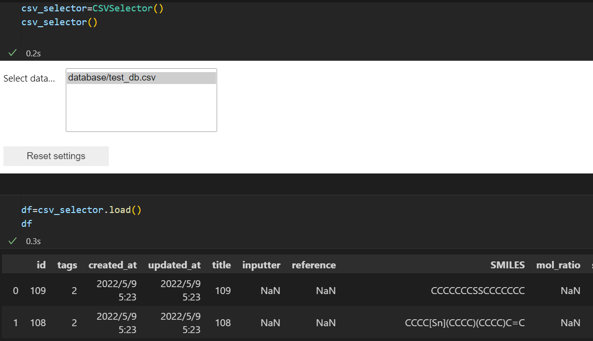

# GUIML
# GUI wrapper modules for materials informatics (MI) of Python

# Install
- pip3 install git+https://github.com/KanHatakeyama/guiml.git
- or
- pip3 install --force-reinstall  git+https://github.com/KanHatakeyama/guiml.git

# What?
- (Hopefully) Programming-free interface of Python and machine learning
- 

- Available
  - CSV load
  - Molecular descriptor calculation
  - Make graphs
  - Select columns
  - Select IDs
  - Select Models
  - Prediction

# How to use
- Run [Tutorial](Tutorial.ipynb)

# Requirements
- TBD

# Author
  - Kan Hatakeyama-Sato
  - Waseda University
  - https://kanhatakeyama.github.io/
